# VidSum GNN Data Flow Diagram

```mermaid
flowchart TD
    %% External Entities
    USER([👤 User<br/>External Entity])

    %% Trust Boundaries
    subgraph "Trust Boundary - User Interface"
        UI[📱 User Interface<br/>React Frontend]
    end

    subgraph "Trust Boundary - Application"
        API[🚀 API Gateway<br/>FastAPI Backend]
        WS[🔄 WebSocket<br/>Real-time Updates]
    end

    subgraph "Trust Boundary - Processing"
        UPLOAD[📤 Upload Handler<br/>File Validation]
        PROCESSOR[⚙️ Video Processor<br/>Transcoding & Shots]
        FEATURE_EXT[🧠 Feature Extractor<br/>Multimodal Features]
        GRAPH_BUILDER[📊 Graph Constructor<br/>Scene Graph]
        GNN_ENGINE[🕸️ GNN Inference<br/>Importance Scoring]
        SELECTOR[🎯 Shot Selector<br/>Optimization]
        ASSEMBLER[🎬 Summary Assembler<br/>Video & Text]
    end

    subgraph "Trust Boundary - Storage"
        FILE_STORE[(💾 File System<br/>uploads/ processed/ outputs/)]
        DATABASE[(🗄️ TimescaleDB<br/>Metadata & Summaries)]
        CACHE[(⚡ Redis Cache<br/>Sessions & Temp Data)]
    end

    subgraph "Trust Boundary - External Services"
        VIT_MODEL[🤖 ViT-B/16<br/>Visual Features]
        WAV2VEC_MODEL[🎵 Wav2Vec2<br/>Audio Features]
        FLAN_MODEL[📝 FLAN-T5<br/>Text Generation]
        FFMPEG_TOOL[🎬 FFmpeg<br/>Video Processing]
    end

    %% Data Flows
    USER -->|Upload Video File| UI
    UI -->|HTTP POST /upload| API
    API -->|Validated Video| UPLOAD

    UPLOAD -->|Video File| FILE_STORE
    UPLOAD -->|Video Metadata| DATABASE
    UPLOAD -->|Video ID| PROCESSOR

    PROCESSOR -->|Read Video| FILE_STORE
    PROCESSOR -->|FFmpeg Commands| FFMPEG_TOOL
    FFMPEG_TOOL -->|Transcoded Video| PROCESSOR
    PROCESSOR -->|Shot Boundaries| DATABASE
    PROCESSOR -->|Processed Chunks| FILE_STORE

    PROCESSOR -->|Video Chunks| FEATURE_EXT
    FEATURE_EXT -->|Visual Frames| VIT_MODEL
    VIT_MODEL -->|Visual Embeddings| FEATURE_EXT
    FEATURE_EXT -->|Audio Segments| WAV2VEC_MODEL
    WAV2VEC_MODEL -->|Audio Embeddings| FEATURE_EXT
    FEATURE_EXT -->|Handcrafted Features| FEATURE_EXT
    FEATURE_EXT -->|Combined Features| DATABASE
    FEATURE_EXT -->|Feature Files| FILE_STORE

    FEATURE_EXT -->|Shot Features| GRAPH_BUILDER
    GRAPH_BUILDER -->|Scene Graph| GNN_ENGINE
    GNN_ENGINE -->|Importance Scores| DATABASE
    GNN_ENGINE -->|Scored Graph| SELECTOR

    SELECTOR -->|User Preferences| SELECTOR
    SELECTOR -->|Selected Shots| ASSEMBLER
    ASSEMBLER -->|Shot List| FFMPEG_TOOL
    FFMPEG_TOOL -->|Summary Video| ASSEMBLER
    ASSEMBLER -->|Summary Video| FILE_STORE
    ASSEMBLER -->|Video Summary| DATABASE

    ASSEMBLER -->|Summary Context| FLAN_MODEL
    FLAN_MODEL -->|Text Summary| ASSEMBLER
    ASSEMBLER -->|Text Summary| DATABASE

    ASSEMBLER -->|Processing Complete| API
    API -->|Results Metadata| UI
    UI -->|Results Data| USER

    %% Real-time Updates
    PROCESSOR -->|Progress Logs| WS
    FEATURE_EXT -->|Progress Logs| WS
    GRAPH_BUILDER -->|Progress Logs| WS
    GNN_ENGINE -->|Progress Logs| WS
    SELECTOR -->|Progress Logs| WS
    ASSEMBLER -->|Progress Logs| WS
    WS -->|Real-time Updates| UI

    %% Configuration and Status
    UI -->|Processing Status Request| API
    API -->|Status Query| DATABASE
    DATABASE -->|Current Status| API
    API -->|Status Response| UI

    UI -->|Download Request| API
    API -->|Video File| FILE_STORE
    FILE_STORE -->|Summary Video| API
    API -->|Download Response| UI

    %% Caching
    API -->|Session Data| CACHE
    CACHE -->|Cached Data| API

    %% Styling
    classDef externalEntity fill:#e3f2fd,stroke:#1976d2,stroke-width:3px
    classDef trustBoundary fill:#fff3e0,stroke:#f57c00,stroke-width:2px
    classDef process fill:#e8f5e8,stroke:#388e3c,stroke-width:2px
    classDef dataStore fill:#fce4ec,stroke:#c2185b,stroke-width:2px
    classDef externalService fill:#f3e5f5,stroke:#7b1fa2,stroke-width:2px

    class USER externalEntity
    class UI,API,WS,UPLOAD,PROCESSOR,FEATURE_EXT,GRAPH_BUILDER,GNN_ENGINE,SELECTOR,ASSEMBLER process
    class FILE_STORE,DATABASE,CACHE dataStore
    class VIT_MODEL,WAV2VEC_MODEL,FLAN_MODEL,FFMPEG_TOOL externalService
```



## Data Flow Analysis

### Overview
The VidSum GNN system processes video files through a complex AI pipeline that transforms raw video data into intelligent summaries. The data flow follows a sequential pipeline pattern with parallel processing for feature extraction and real-time progress monitoring.

### Key Data Flows

#### 1. Video Ingestion Flow
```
User → UI → API → Upload Handler → File System (uploads/)
                                      → Database (metadata)
```

**Data Elements:**
- Raw video file (MP4, AVI, etc.)
- File metadata (size, duration, format)
- User preferences (summary length, type, format)

#### 2. Video Processing Flow
```
File System → Video Processor → FFmpeg → Processed Chunks → File System
                              → Shot Boundaries → Database
```

**Data Elements:**
- Transcoded video chunks (5-10s segments)
- Shot boundary timestamps
- Video metadata (resolution, frame rate, codec)

#### 3. Feature Extraction Flow (Parallel Processing)
```
Video Chunks → Feature Extractor → ViT-B/16 → Visual Embeddings → Database
                              → Wav2Vec2 → Audio Embeddings → Database
                              → Handcrafted → Motion/Color Features → Database
                              → Combined Features → File System
```

**Data Elements:**
- Visual features: 768-dim embeddings per frame
- Audio features: 768-dim embeddings per segment
- Handcrafted features: Motion vectors, color histograms, etc.
- Combined multimodal features: 1536-dim vectors per shot

#### 4. Graph Construction Flow
```
Shot Features → Graph Builder → Scene Graph (Nodes + Edges)
```

**Data Elements:**
- **Nodes**: Shot features with temporal metadata
- **Edges**:
  - Temporal: Adjacent shots in time
  - Semantic: Content similarity (cosine distance)
  - Audio: Speech pattern continuity

#### 5. GNN Inference Flow
```
Scene Graph → GNN Engine → Importance Scores → Database
```

**Data Elements:**
- Graph structure (adjacency matrices)
- Node features (multimodal embeddings)
- Edge weights (relationship strengths)
- Importance scores (0-1 probability per shot)

#### 6. Summary Generation Flow
```
Importance Scores → Shot Selector → Selected Shots → Summary Assembler
User Preferences → Shot Selector
```

**Data Elements:**
- Selection criteria (length, type, strategy)
- Selected shot list with timestamps
- Summary video segments
- Summary text context

#### 7. Output Generation Flow (Parallel)
```
Selected Shots → FFmpeg → Summary Video → File System
Summary Context → FLAN-T5 → Text Summary → Database
```

**Data Elements:**
- Summary video file (concatenated shots)
- Text summary (bullet/structured/plain format)
- Summary metadata (duration, compression ratio)

### Real-time Monitoring Flow
```
All Processors → WebSocket → UI → User
```

**Data Elements:**
- Progress percentages
- Current processing stage
- Log messages (INFO, WARNING, ERROR)
- Performance metrics (GPU/CPU usage)

### Data Storage Patterns

#### File System Storage
- **uploads/**: Original video files (persistent)
- **processed/**: Transcoded chunks and intermediate files (temporary)
- **outputs/**: Generated summary videos (persistent)
- **temp/**: Batch processing cache (auto-cleaned)

#### Database Storage (TimescaleDB)
- **Videos Table**: Video metadata, upload timestamps
- **Shots Table**: Shot boundaries, durations, features
- **Summaries Table**: Generated summaries, scores, metadata
- **Embeddings Table**: Time-series feature storage

#### Cache Storage (Redis)
- **Session Data**: User preferences, processing state
- **Temporary Results**: Intermediate processing results
- **Progress Tracking**: Real-time status updates

### Trust Boundaries

The system implements multiple trust boundaries for security:

1. **User Interface Boundary**: Client-side validation and input sanitization
2. **Application Boundary**: API authentication and request validation
3. **Processing Boundary**: Isolated ML processing environment
4. **Storage Boundary**: Database and file system access controls
5. **External Services Boundary**: Secure API calls to external models

### Data Flow Security Considerations

#### Input Validation
- File type verification (video formats only)
- Size limits and rate limiting
- Content scanning for malicious files

#### Data Encryption
- HTTPS for all external communications
- Encrypted database connections
- Secure file storage with access controls

#### Data Minimization
- Automatic cleanup of temporary files
- Feature data retention policies
- Audit logging for compliance

### Performance Optimization

#### Parallel Processing
- Feature extraction runs in parallel (visual + audio + handcrafted)
- Batch processing for memory efficiency
- GPU acceleration for ML inference

#### Caching Strategy
- Redis caching for frequently accessed data
- File system caching for processed chunks
- Database query optimization with indexes

#### Memory Management
- Automatic GPU cache clearing (`torch.cuda.empty_cache()`)
- Batch-wise processing to control memory usage
- Garbage collection after each processing stage

This data flow diagram provides a comprehensive view of how information moves through the VidSum GNN system, from user input to AI-generated video summaries, ensuring efficient processing and real-time user feedback.</content>
<parameter name="filePath">e:\5th SEM Data\AI253IA-Artificial Neural Networks and deep learning(ANNDL)\ANN_Project\DATA_FLOW_DIAGRAM.md