# VidSum GNN Data Flow (Simplified)

```mermaid
flowchart TD
    A[👤 User] -->|Upload Video| B[📱 Frontend<br/>React]
    B -->|HTTP Request| C[🚀 Backend<br/>FastAPI]

    C -->|Save File| D[(💾 File Storage<br/>uploads/)]
    C -->|Start Processing| E[⚙️ Video Processor]

    E -->|Read Video| D
    E -->|Transcode| F[🎬 FFmpeg]
    F -->|Processed Video| E
    E -->|Save Chunks| D

    E -->|Video Chunks| G[🧠 Feature Extractor]
    G -->|Frames| H[🤖 ViT-B/16]
    G -->|Audio| I[🎵 Wav2Vec2]
    H -->|Visual Features| G
    I -->|Audio Features| G
    G -->|Combined Features| J[(🗄️ Database)]

    G -->|Features| K[📊 Graph Builder]
    K -->|Scene Graph| L[🕸️ GNN Engine]
    L -->|Importance Scores| J

    L -->|Scores| M[🎯 Shot Selector]
    M -->|Selected Shots| N[🎬 Summary Generator]

    N -->|Shot List| F
    F -->|Summary Video| N
    N -->|Save Video| D

    N -->|Context| O[📝 FLAN-T5]
    O -->|Text Summary| N
    N -->|Save Text| J

    N -->|Complete| C
    C -->|Results| B
    B -->|Display| A

    %% Real-time updates
    E -.->|Progress| P[🔄 WebSocket]
    G -.->|Progress| P
    K -.->|Progress| P
    L -.->|Progress| P
    M -.->|Progress| P
    N -.->|Progress| P
    P -.->|Live Updates| B
```

## Simple Data Flow Overview

### Main Data Path (9 Steps)
1. **User** uploads video file
2. **Frontend** sends to **Backend**
3. **Backend** saves file and starts processing
4. **Video Processor** transcodes video into chunks
5. **Feature Extractor** gets visual (ViT) + audio (Wav2Vec2) features
6. **Graph Builder** creates scene relationships
7. **GNN Engine** scores shot importance
8. **Summary Generator** creates video + text summary
9. **Results** displayed to user

### Key Data Types
- **Video Files**: Original and processed chunks
- **Features**: 768-dim visual + 768-dim audio = 1536-dim combined
- **Graphs**: Nodes (shots) + edges (relationships)
- **Scores**: Importance rankings (0-1) per shot
- **Summaries**: Short video + text description

### Real-time Features
- **WebSocket**: Live progress updates
- **Progress Logs**: Step-by-step status
- **Performance**: GPU/CPU usage monitoring

### Storage Used
- **File System**: Videos, chunks, outputs
- **Database**: Metadata, features, scores
- **Cache**: Temporary processing data

This simplified flow shows how your video goes from upload to AI-generated summary in clear, understandable steps.