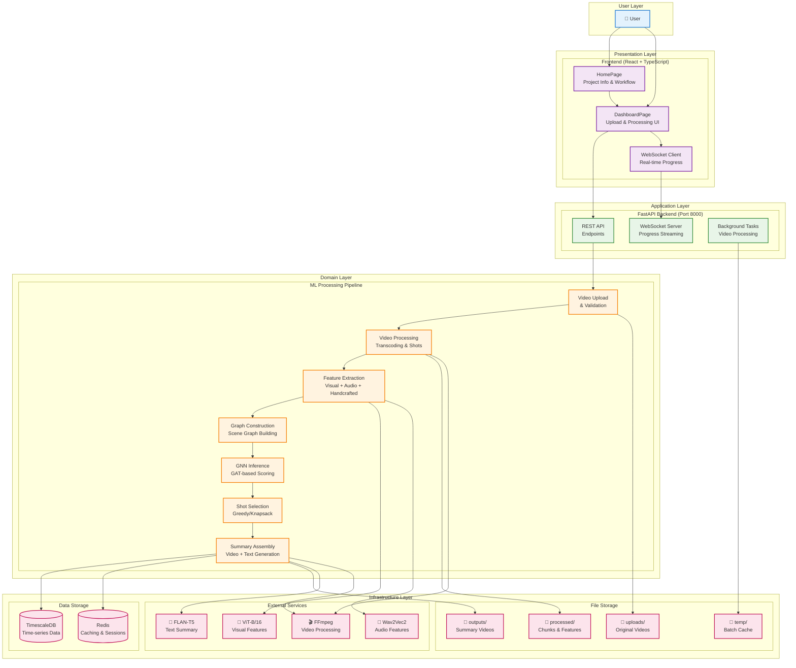

# VidSum GNN System Architecture

## Architecture Overview

### Layered Architecture Pattern
VidSum GNN follows a **layered architecture** with clear separation of concerns:

#### 1. User Layer
- **Purpose**: Human interaction interface
- **Components**: End users accessing the system

#### 2. Presentation Layer
- **Technology**: React 18 + TypeScript + Vite
- **Components**:
  - **HomePage**: Project information, workflow explanation, team details
  - **DashboardPage**: Video upload interface, processing controls, results display
  - **WebSocket Client**: Real-time progress updates and log streaming

#### 3. Application Layer
- **Technology**: FastAPI (Python async web framework)
- **Components**:
  - **REST API**: HTTP endpoints for upload, processing, status, results
  - **WebSocket Server**: Bidirectional communication for real-time updates
  - **Background Tasks**: Asynchronous video processing using FastAPI's background tasks

#### 4. Domain Layer (Core Business Logic)
- **Technology**: PyTorch + PyTorch Geometric + Custom ML pipeline
- **Components**:
  - **Video Upload & Validation**: File handling, format checking, metadata extraction
  - **Video Processing**: Transcoding, shot detection, chunking
  - **Feature Extraction**: Multimodal feature extraction (visual, audio, handcrafted)
  - **Graph Construction**: Building scene graphs with temporal/semantic/audio edges
  - **GNN Inference**: Graph Attention Network for importance scoring
  - **Shot Selection**: Optimization algorithms (greedy, knapsack) for summary creation
  - **Summary Assembly**: Video concatenation and text summary generation

#### 5. Infrastructure Layer
- **Data Storage**:
  - **TimescaleDB**: Time-series database for videos, shots, embeddings, summaries
  - **Redis**: Caching layer for session management and temporary data
- **File Storage**:
  - **uploads/**: Original video files
  - **processed/**: Processed video chunks and extracted features
  - **outputs/**: Generated summary videos
  - **temp/**: Temporary batch processing cache (auto-cleaned)
- **External Services**:
  - **ViT-B/16**: Pretrained Vision Transformer for visual feature extraction
  - **Wav2Vec2**: Pretrained audio model for speech/audio feature extraction
  - **FLAN-T5**: Large language model for text summary generation
  - **FFmpeg**: Video processing toolkit for transcoding and assembly

### Key Architectural Patterns

#### Microservices-Ready Design
- **Modular Components**: Each processing stage is a separate module
- **Dependency Injection**: Clean interfaces between components
- **Configuration Management**: Centralized settings via Pydantic models

#### Event-Driven Processing
- **WebSocket Communication**: Real-time progress updates
- **Background Task Processing**: Non-blocking video processing
- **Asynchronous Operations**: Async/await throughout the FastAPI backend

#### Data Pipeline Architecture
- **Batch Processing**: Memory-efficient handling of long videos
- **Checkpoint System**: Progress saving at batch boundaries
- **Memory Management**: Automatic GPU/CPU cache clearing

#### Multimodal AI Architecture
- **Feature Fusion**: Combining visual, audio, and handcrafted features
- **Graph-Based Modeling**: Treating videos as graphs rather than sequences
- **Pretrained Models**: Leveraging state-of-the-art foundation models

### Communication Patterns

#### Synchronous Communication
- **HTTP REST**: Standard request/response for CRUD operations
- **File Upload/Download**: Direct binary data transfer

#### Asynchronous Communication
- **WebSocket**: Bidirectional real-time messaging for progress updates
- **Background Tasks**: Fire-and-forget processing for long-running operations

#### Data Flow Patterns
- **Pipeline Pattern**: Sequential processing through ML pipeline stages
- **Observer Pattern**: Frontend observing backend processing state
- **Repository Pattern**: Data access abstraction via SQLAlchemy

### Scalability Considerations

#### Horizontal Scaling
- **Stateless Backend**: FastAPI instances can be scaled independently
- **Shared Storage**: File storage accessible by multiple instances
- **Database Clustering**: TimescaleDB supports horizontal scaling

#### Vertical Scaling
- **GPU Acceleration**: CUDA support for ML inference
- **Memory Optimization**: Batch processing and cache management
- **Resource Monitoring**: Real-time GPU/CPU usage tracking

### Security Architecture

#### Input Validation
- **File Type Checking**: Video format validation
- **Size Limits**: Configurable upload size restrictions
- **Content Scanning**: Basic file integrity checks

#### Access Control
- **Open Access**: Currently designed for academic/demo use
- **Future Extensions**: Authentication middleware ready for expansion

#### Data Protection
- **Secure Storage**: Encrypted database connections
- **Temporary File Cleanup**: Automatic removal of processing artifacts

### Deployment Architecture

#### Containerized Deployment
- **Docker**: Backend containerization
- **Docker Compose**: Multi-service orchestration
- **Volume Management**: Persistent data storage

#### Development vs Production
- **Local Setup**: Simplified single-container development
- **Production Ready**: Scalable multi-container deployment

This architecture provides a robust, scalable foundation for AI-powered video summarization while maintaining clean separation of concerns and modularity for future enhancements.</content>
<parameter name="filePath">e:\5th SEM Data\AI253IA-Artificial Neural Networks and deep learning(ANNDL)\ANN_Project\SYSTEM_ARCHITECTURE.md